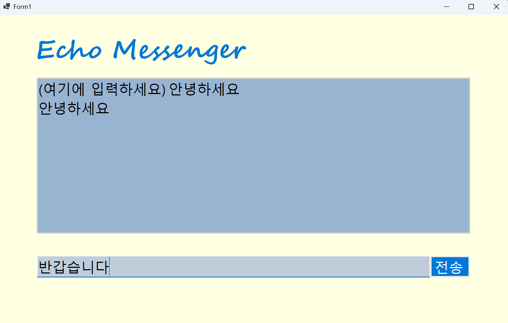
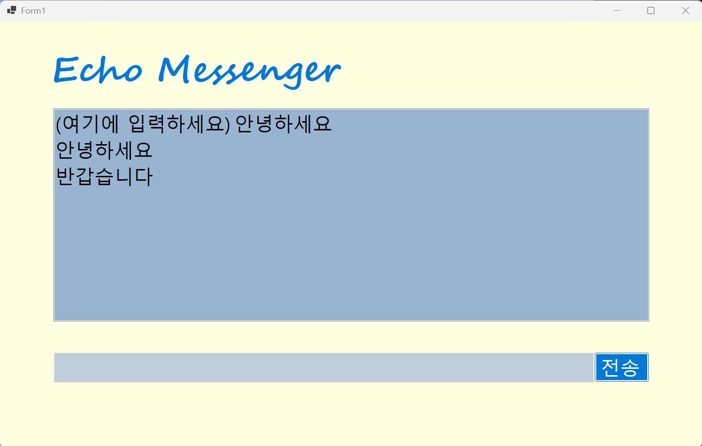
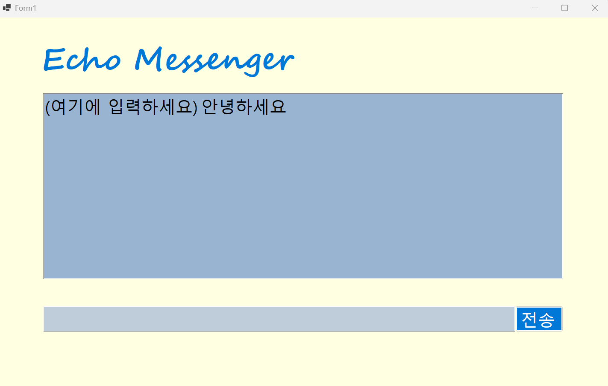

# (C# 코딩) 메신저 프로그램
## 개요

-C# 프로그래밍학습

-1줄소개: 채팅을 입력받고, 입력받은 채팅을 메시지칸에 출력하는 프로그램

-사용한플랫폼: 

 -C#, .NET Windows Forms, Visual Studio, GitHub

-사용한컨트롤:

 -Label, TextBox, ListBox, Button

-사용한기술과구현한기능:

 -객체지향 프로그래밍 기반 UI이벤트 처리 구현

 -버튼 클릭 이벤트 구현

 -키 입력 이벤트 구현

 -사용자가 입력한 텍스트를 가져옴

 -공백을 입력했을 경우 전송을 막음

 -입력한 메시지를 리스트박스에 추가

 -메시지 전송 후 입력창 비움

 -전송 후에도 다시 입력창에 커서 위치

 -enter 키로 전송기능 구현
 

 ## 실행화면(과제1)
 
 
 -과제1코드의실행스크린샷

 
 
 

 -과제내용

 -컨트롤 배치와 기본적인 속성(Text,Items 등) 제어

 -UI 구성을 위한 label, textbox, button, listbox 적절히 사용 및 배치

 -전송 버튼 클릭시 TextBox의 텍스트를 ListBox의 항목으로 추가

 - LisBox에 항목 추가 후 TextBox의 텍스트를 Clear하여 입력창 초기화

 

 -구현내용과기능설명

 -Windows Forms 기반으로 메신저 형태의 UI를 구성

 -사용자가 TextBox에 메시지를 입력하고 Button을 클릭하면, TextBox의 텍스트가 ListBox에 항목으로 추가된다.

 -내용이 List Box에 하나의 항목으로 추가되어 화면에 표시된다.

 -사용자가 입력한 메시지가 위에서 아래로 순서대로 누적되어 출력된다.

 -메시지가 전송된 이후 입력창에 있던 텍스트가 자동으로 삭제되어 빈 상태로 바뀐다.

 -전송 후 사용자는 새로운 메시지를 바로 입력할 수 있다.

 ## 실행화면(과제2)

 -과제2코드의실행스크린샷

 -과제내용

-전송 후 입력창에 남겨진 기존 메시지 삭제

-전송후 마우스 커서를 자동으로 입력창으로 위치

-마우스 클릭 대신 엔터키로 메시지 전송 기능 구현

-내용이 없는 경우 메시지 전송 방지

 -구현내용과기능설명

-메시지를 전송하면 입력창에 남아있던 기존 내용이 자동으로 사라진다.

-마우스를 사용하지 않아도 커서가 다시 입력창에 위치하여 바로 다음 메시지를 입력할 수 있다.

-사용자가 Enter 키를 누르면 전송 버튼을 클릭한 것과 동일하게 메시지가 ListBox에 추가되어 화면에 표시된다.

-사용자가 아무 내용도 입력하지 않은 상태에서 전송을 시도할 경우에는 ListBox에 아무 항목도 추가 되지 않으며, 화면에 변화가 나타나지 않는다.

